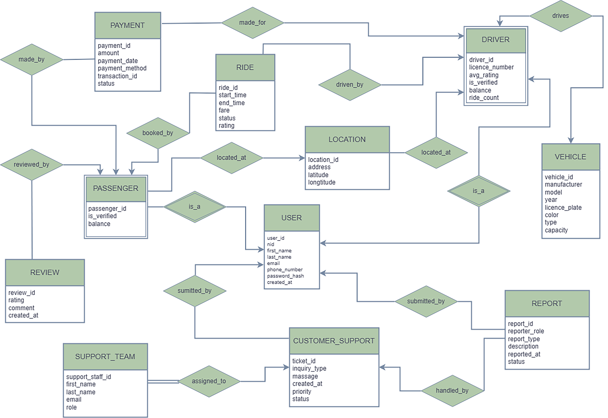

# Carpool Management System - DBMS Project

A comprehensive backend database system engineered to manage the complete operational lifecycle of a modern carpool service, built with Microsoft SQL Server.

This project was developed for the **CSE 211: Database Systems** course at the **University of Asia Pacific**.


---

## Project Information

| | |
| :--- | :--- |
| **Course** | CSE 211: Database Systems |
| **Institution** | University of Asia Pacific |
| **Instructor** | Nadeem Ahmed, Assistant Professor |
| **Authors** | MD FATAHARUL ISLAM - 23201062 |
| | INTISAR RAHMAN KHAN - 23201097 |
| | MD JUBAIR BIN HASAN - 23201065 |
| | SHIRIN AKTER - 23201056 |

---

## 1. Project Summary

This project is a robust, scalable, and reliable relational database (RDBMS) that serves as the "single source of truth" for all application activities. It is designed to handle complex, real-time interactions between passengers, drivers, and support administrators[cite: 5].

### Core Objectives
The primary goal is to provide a normalized (3NF), high-integrity database schema that ensures data consistency and reliability. The system is engineered to solve key business challenges:

* **Reliable Bookings**: Ensuring that a ride booking is an atomic (all-or-nothing) transaction
* **Fair Matching**: Logically matching passengers with the nearest suitable driver
* **Financial Integrity**: Accurately managing financial transactions and balances for all users
* **User Trust**: Providing a reliable system for reviews, ratings, and support

---

## 2. Key Features & Technical Logic

The schema is designed to handle complex engineering problems through several key features:

* **Role-Based User Management**: The schema distinguishes between a base `User`, a `Passenger`, and a `Driver`, using foreign keys to link specialized roles to a central identity.
* **Geospatial Ride Matching**: The system is built to find the nearest driver using the **Haversine formula** by comparing the passenger's latitude/longitude with available driver locations.
* **Transactional Ride Lifecycle**: The entire ride booking process is wrapped in a single, atomic **SQL transaction** This ensures that fare calculation, passenger balance deduction, driver balance addition, and ride record creation all succeed or fail together, preventing data corruption.
* **Dynamic Fare & Rating Models**:
    * **Fare**: Calculated dynamically based on distance (via Haversine) and vehicle type.
    * **Rating**: The driver's `avg_rating` is a weighted average, recalculated after each ride to provide a fair representation of their performance.
* **Integrated Support Module**: A complete subsystem for accountability. The `Report` and `Customer_Support` tables allow users to file tickets, which are then managed and resolved by the `Support_Team`.

---

## 3. Technology Used

* **Database**: Microsoft SQL Server 
* **Design**: 3rd Normal Form (3NF) 
* **Logic**: T-SQL, Stored Procedures, and Atomic Transactions

---

## 4. How to Use This Project

1.  **Clone the Repository**
    ```sh
    git clone [https://github.com/YOUR_USERNAME/Carpool-Management-System-DBMS.git](https://github.com/YOUR_USERNAME/Carpool-Management-System-DBMS.git)
    ```
2.  **Set Up the Database**
    * Open Microsoft SQL Server Management Studio (SSMS).
    * Create a new database named `Carpool`.
    * Open and execute the SQL files in the following order:

3.  **Run the SQL Scripts**
    * **`sql/01_Schema_DDL.sql`**: Creates all the required tables, keys, and constraints 
    * **`sql/02_Data_DML.sql`**: Populates the database with sample data for users, drivers, vehicles, etc.
    * **`sql/03_Business_Logic.sql`**: Contains the main transactional queries. You can execute the "Ride Booking" or "Support Ticket" blocks to test the system's core functionality
    * **`sql/04_Verification.sql`**: Contains various `SELECT` statements to check ride history, user balances, and report status after running the business logic queries

---

## 5. Database Diagrams

### Entity-Relationship (ER) Diagram
This diagram shows the conceptual model and relationships between entities.



### Schema Diagram (Relational Model)
This diagram shows the final physical database schema with tables, columns, data types, and foreign key relationships.


